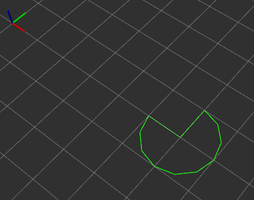
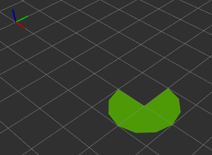
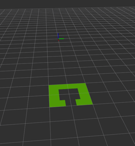
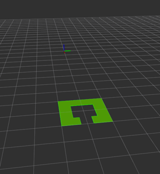
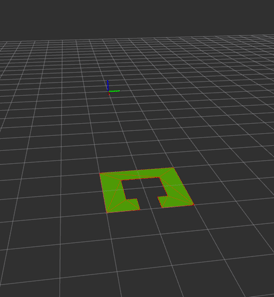

# rviz_polygon_filled

Plugin for rviz which display filled polygon.

## Examples

Here is image which represent display of polygon by default rviz plugin:

Here is image which represent display of polygon by fill plugin plugin:

In plugin configuration you can choose to display in any combination:

* Fill polygon
  * Choose color for fill
  * Cho0se if front face on both face should be drawn
* Border
  * Choose color for border
* Triangulation mesh
  * Choose color for mesh

Below you can see examples:

## Usage

To use this plugin:

1. Copy package inside your workspace
1. Compile whole workspace
1. Open terminal and source from workspace
1. From this terminal run rviz

It is important to run rviz in workspace environment because rviz need to load library from there. When you run rviz outside of workspace environment library will not be loaded and you get error.

As an alternative you can install this package on your machine. In future I will try to add this plugin to ros index and every one will be able to just apt install it.

To draw valid polygon you need to publish list of point in correct order. One point after another on polygon border. It can be clockwise or counter clockwise order.

### Limitations

Current implementation only support drawing filled polygon on XY plane. In features it will be changed to any possible plane and may by partial 3D (like waves).

Triangulation is computational hard and expensive process. In general for polygons:

* below 20 points it should be above 30 fps
* between 20 and 100 should be between 1 and 30 fps
* above 100 it will take fev seconds

Of course it very depend on hardware on which you run this plugin. Also if this hardware is not already under heavy usage from other algorithms. PC with i7 will make 30 fps where raspberrypi hardly 5 fps for example.  

## Technical description

Plugin is very easy from technical point of view. Plugin is using rviz class MessageFilter class to get only geometry_msgs::PolygonStamp type of messages. Flow of program is straightforward:

1. Get points from message
1. Validate points
1. Convert point to data structure used for triangulation
1. Do triangulation
1. Create ogre triangle list from triangulation results
1. Display on screen

Whole magic (triangulation) is done by library poly2tri.

In case that both faces need to be displayed plugin draw front face of triangle and reverse order of points and draw back face. By this process number of points and faces is double.

## Motivation

ROS with its rviz 3D visualization environment is very very powerful tool. In project on which I was working we were visualizing multiple data in realtime to provide situational awareness for our stuff. I must also said that with little more work we cloud achieve not only usable but also beautiful visualization (of course for engineers!).

Some day we got job to visualize filled polygon. Should be easy task! And I found that ... it is not easy at all. By default rviz do not support such task. It can only display polygon as border. Ok but there should be such plugins made by _community_ which just do it. There is very nice library called [jsk_visualization](https://github.com/jsk-ros-pkg/jsk_visualization) and it has custom plugin for rviz which can display custom visualization message called PolygonArray. Sadly this plugin does not fullfil our needs:

* properties of visualization like color and alpha was defined inside message not as properties in rviz
** yep this topic is about principle who should define colors on rviz
* visualization was bugged when polygon was concave
* visualization does not handle case when polygon has holes inside

As result in decision was done in project to workaround problem.

But this task stay with me for some time and finally. I decided to make such plugin which will do it right.

## Mathematics

Why filled polygon was hard task to be done? This is because of way how computer draw objects on monitor. In general graphic card is working on triangles. Triangle is defined by three points which order is crucial. Those three points define plane from which we can draw vector orthogonal to this plane. This vector is called _normal_. Graphic card to draw shadows and colors calculate angle between light source beam and normal of our triangle. That is why order of points inside triangle is very important. If we have triangle ABC and normal pointed upwards then triangle CBA will have normal pointe downwards. So final colors of both triangles will be very different!

Now back to polygon. As we said graphic card draws triangles so we must make from our polygon array of triangles. When we have simple polygon with points ABCDEF than we need to split it into ABC BCD CDE DEF and remember of point order! We need to have also in mind that we have to handle concave polygon where we can't draw for example CDE triangle but other. What about holes inside? This problem is called triangulation and is very important on many fields from computer graphic to cartographic. Many clever gays try to make easy and fast solution just search on internet about this problem.

In this plugin we will use library called poly2tri which is implementation of modified constrained 2D Delaunay triangulation.
This algorithm handles well:

* simple polygons
* concave polygons
* polygons with holes

And as always with triangulation better algorithm you choose than longer will it take to return solution.
